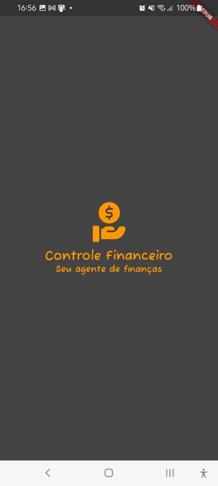
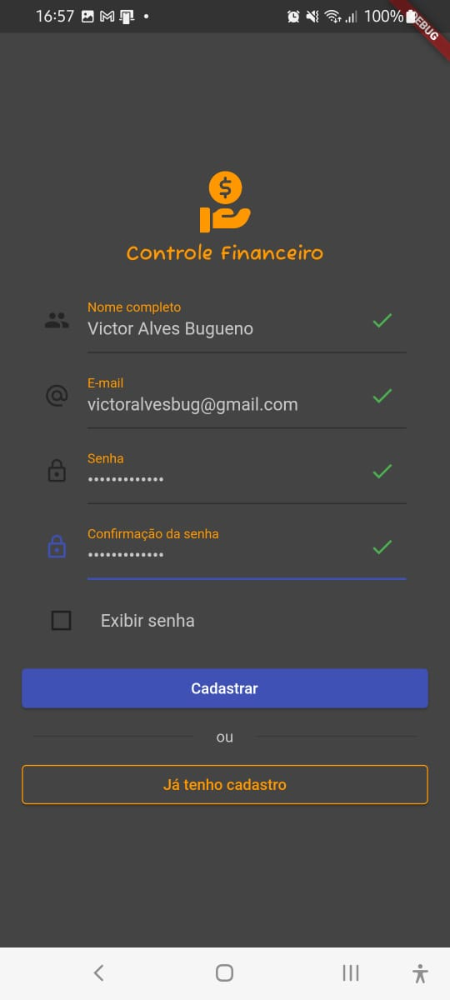
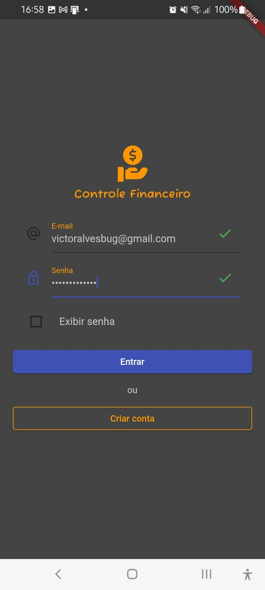
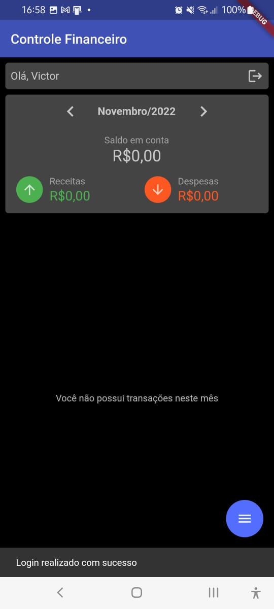
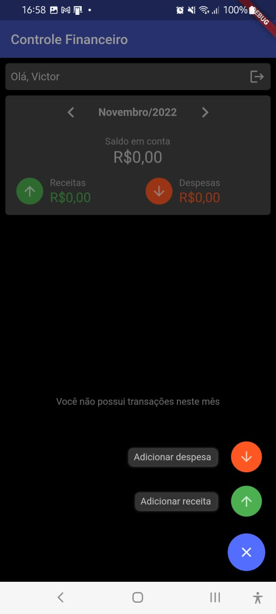
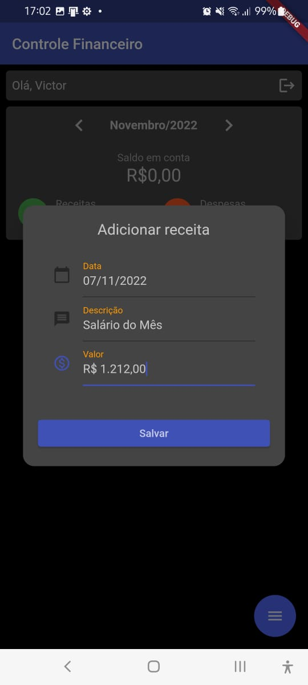
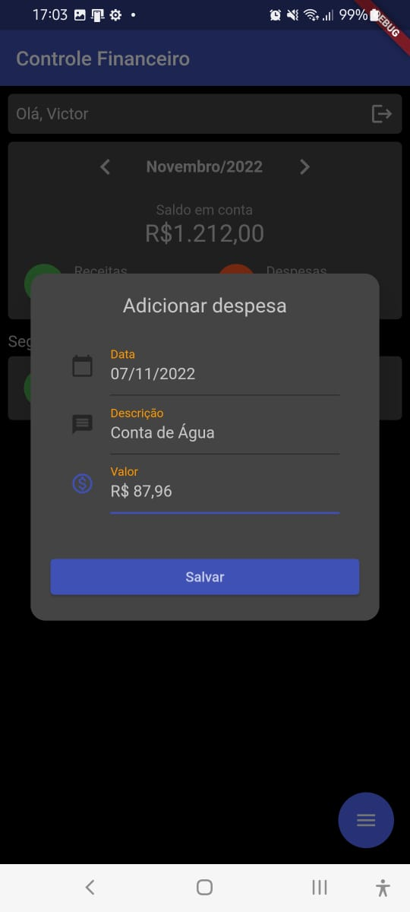
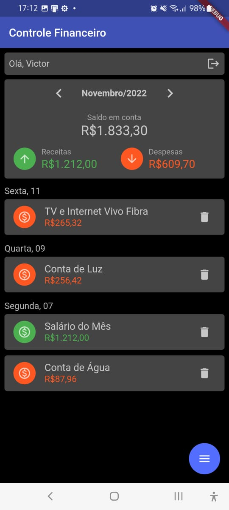
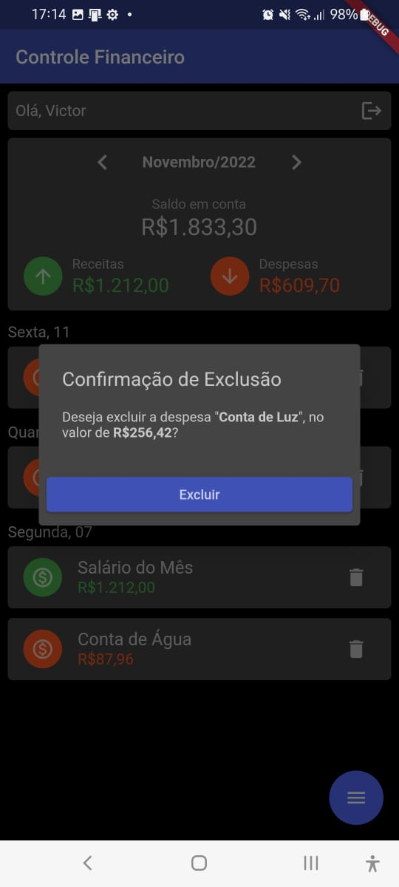
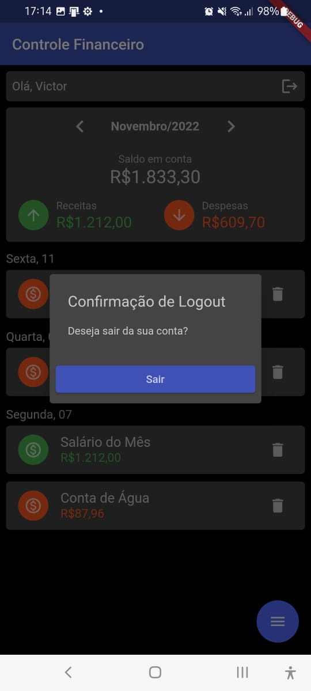

# app-controle-financeiro

Aplicativo **Mobile Flutter** desenvolvido para a disciplina de 
**Mobile Development** no MBA da **FIAP** (43SCJ).

Este aplicativo foi criado com base no aplicativo de finanças
[**Mobills**](https://web.mobills.com.br/dashboard), que tem como objetivo 
melhorar o controle de suas **receitas** e **despesas** mensais.

## Integrantes do Grupo

- RM 344245 - <a target="_blank" rel="noopener" href="https://www.linkedin.com/in/matheus-ciribeli/">Matheus Ciribeli </a>
- RM 345763 - <a target="_blank" rel="noopener" href="https://www.linkedin.com/in/victor-alves-bugueno-122438144/">Victor Alves Bugueno</a>
- RM 344869 - <a target="_blank" rel="noopener" href="https://www.linkedin.com/in/victor-dias-6b505275/">Victor Augusto Dias</a>

## Configurando o aplicativo

Configure a 
[api-controle-financeiro](https://github.com/VictorAlvesBug/api-controle-financeiro), 
utilizada pelo aplicativo, conforme README da API.

Realize o clone do 
[repositório do aplicativo](https://github.com/VictorAlvesBug/app-controle-financeiro)
executando o seguinte comando no **cmd**, dentro da pasta desejada:

```bach
git clone https://github.com/VictorAlvesBug/app-controle-financeiro.git
```

No **Android Studio**, abra o projeto recém-clonado.

Abra o **cmd** ou o **terminal** da IDE na pasta do projeto e execute os 
seguintes comandos para **atualizar o Flutter** e carregar as 
**dependências do projeto**:

```bash
flutter upgrade
flutter pub get
```

Execute no **cmd** o seguinte comando e utilize o IP de Wi-Fi retornado na 
constante **_wifiIp** do arquivo 
[api_service.dart](https://github.com/VictorAlvesBug/app-controle-financeiro/blob/master/lib/src/services/api_service.dart)

```bash
ipconfig
```

É necessário que o computador que está rodando a API esteja conectado à 
**mesma rede Wi-Fi** que o celular android que está rodando o Aplicativo.

Na barra superior do **Android Studio**, selecione o dispositivo que deseja 
utilizar e depois clique no ícone **Run**, com o arquivo **main.dart** 
selecionado.

**Obs.**: Recomendamos **conectar** um celular Android via cabo **USB** ao 
computador e utilizá-lo para rodar o aplicativo, não tendo a necessidade de 
mantê-lo conectado via cabo após o carregamento do aplicativo.

Para utilizar o aplicativo sem criar uma conta, utilize o seguinte login:

- **E-mail**: usuario@anonimo.com
- **Senha**: UsuarioAnonimo123

**Obs.**: lembre-se que, para rodar o aplicativo, é necessário estar com a
[API](https://github.com/VictorAlvesBug/app-controle-financeiro) rodando também.

## Telas principais

Inicialmente é exibida uma **Splash Screen**, enquanto o aplicativo identifica 
se o usuário está **logado** ou não:



Em seguida, caso o usuário não esteja logado, ele pode **criar uma conta** ou 
**entrar** com uma conta já existente:

 

Após entrar, a **tela principal** é exibida, permitindo cadastro de **receitas** 
e **despesas**:

  

 

A lista de transações cadastradas em determinado mês é exibida desta forma, 
sendo ordenada de forma decrescente e **agrupando as transações** de um mesmo 
dia:



Utilizando as setas ao lado da informação do mês atual (**Novembro/2022**) 
podemos visualizar transações de outros meses, podendo voltar ao **mês atual** 
clicando no ícone de **calendário**, no canto superior esquerdo da tela. 


Clicando em uma transação, você 
pode **editar** suas informações, conforme print abaixo:


**Mantendo pressionada** uma transação ou clicando no **ícone de excluir**, 
podemos excluir uma transação:



Caso queira **sair** da sua conta, clique no ícone de logout no canto superior 
direito da tela:


