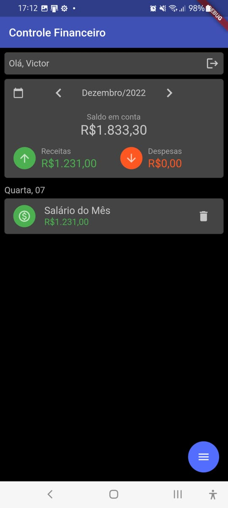

# app-controle-financeiro

Aplicativo Mobile Flutter desenvolvido para a disciplina de Mobile Development
no MBA da FIAP (43SCJ).

Este aplicativo foi criado com base no aplicativo de finanças
[Mobills](https://web.mobills.com.br/dashboard), com objetivo de melhorar o controle de suas
receitas e despesas.

## Configurando o aplicativo

Configure a API utilizada pelo aplicativo
[api-controle-financeiro](https://github.com/VictorAlvesBug/api-controle-financeiro).

Realize o clone do [repositório do aplicativo](https://github.com/VictorAlvesBug/app-controle-financeiro)
executando o seguinte comando no cmd, dentro da pasta desejada:

```bach
git clone https://github.com/VictorAlvesBug/app-controle-financeiro.git
```

No Android Studio, abra o projeto recém-clonado.

Abra o cmd ou o terminal da IDE, na pasta do projeto e execute os seguintes comandos para carregar as
dependências do projeto:

```bash
flutter upgrade
flutter pub get
```

Execute no cmd o seguinte comando e utilize o IP de wifi retornado na constante "_wifiIp" do arquivo
"lib/src/services/api_service.dart"

Na barra superior do Android Studio, selecione o dispositivo que deseja utilizar e depois clique no
ícone Run "main.dart".

Obs.: Recomendamos que conecte um celular android via cabo USB ao computador e utilize-o para rodar
o aplicativo. Não é necessário manter o celular conectado via cabo após o carregamento do aplicativo.

Para utilizar o aplicativo sem a necessidade de criar uma conta, utilize o seguinte login:

- E-mail: usuario@anonimo.com
- Senha: UsuarioAnonimo123

Obs: lembre-se que, para rodar o aplicativo, é necessário estar com a
[API](https://github.com/VictorAlvesBug/app-controle-financeiro) rodando também.

## Telas principais

Inicialmente é exibida uma Splash Screen, enquanto o aplicativo identifica se o usuário está logado ou não:


Em seguida, caso o usuário não esteja logado, ele pode criar uma conta ou entrar com uma conta já existente:

 

Após entrar, a tela principal é exibida, permitindo cadastro de receitas e despesas:

   

A lista de transações cadastradas em determinado mês é exibida desta forma, sendo ordenada de forma decrescente e agrupando as transações de um mesmo dia:


Utilizando as setas ao lado da informação do mês atual "Novembro/2022" podemos visualizar transações de outros meses:



Para voltar ao mês atual, basta clicar no ícone de calendário que é exibido no canto superior esquerdo da tela.
Cricando em uma transação, você pode editar suas informações, conforme print abaixo:


Mantendo pressionada uma transação ou clicando no ícone de excluir, a transação será desativada, após confirmação da ação:


Caso queira sair da sua conta, clique no ícone de logout no canto superior direito da tela:


